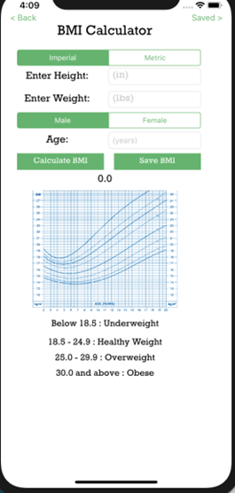

## Description
This project was developed in a four person team.
My Plate is a meal planning iOS app. The app comes with a recipe builder/search function, a calorie counter, and also a BMI calculator. 

### BMI Calculator
In the BMI Calculator screen, the user can calculate their BMI to see what range it is in. Upon calculation, the user can then save their BMI.

### Recipe Search and Save
This page uses networking features and lets the user search for recipes using ingredients that they want. The app is connected to an API (Food2Fork) which will search for the ingredient that the user has searched for and pull up the first 10 recipes. 

The user can select a recipe that they like and choose to either save the recipe in their “Saved Recipes”, or they can open the recipe to view on their browser. If the user chooses “open”, the app opens the url for the recipe (provided by the API) through Safari. If the user chooses “save”, the recipe is added to the user’s “Saved Recipes”, which uses Core Data to save the favorite recipes.

  

### Calorie Counter
This feature allows the user to select some ingredients from a predetermined list, and the calorie counter will add the calories from the foods selected. If the user cannot find their food on the list, they can manually add the ingredient to the counter. When an item is selected from the predetermined list, the ingredient is dropped onto the plate using animation.

## Requirements
- Xcode

## How to Use
Open the file named "MyPlate.xcodeproj." Navigate the app through the main menu. 